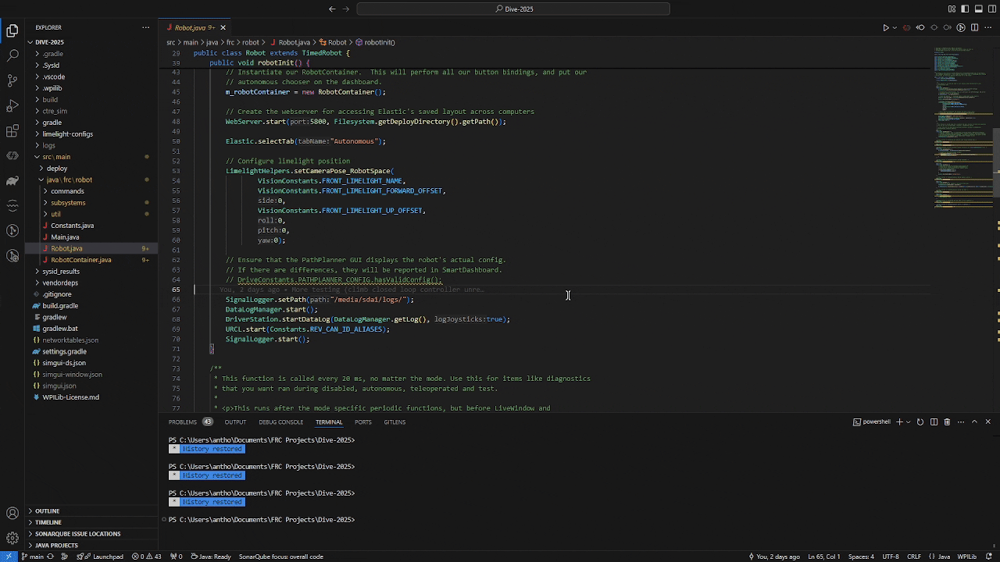

# WPILibJ Integrated Docs

This VSCode extension made by Team 4141 aims to make programming in the [First Robotics Competition](https://www.firstinspires.org/robotics/frc) easier for beginners by providing links to online documentation in the IDE.

## Features
- Detects Java types from [WPILib](https://docs.wpilib.org/en/stable/index.html), [REV](https://docs.revrobotics.com/revlib), [CTRE](https://v6.docs.ctr-electronics.com/en/stable/docs/tuner/), and more
- Provides hovers for types which have a documentation page

## Requirements
This extension requires an internet connection, since it opens up links in your browser.

## Installation

## Limitations
- This extension only provides hovers for Java right now.
- Because this extension uses RegEx, it will match any word that contains a string found in the dictionary.